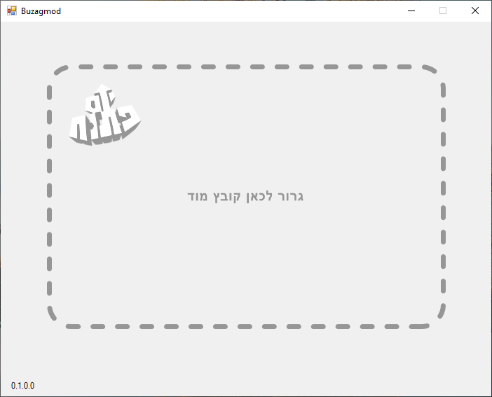
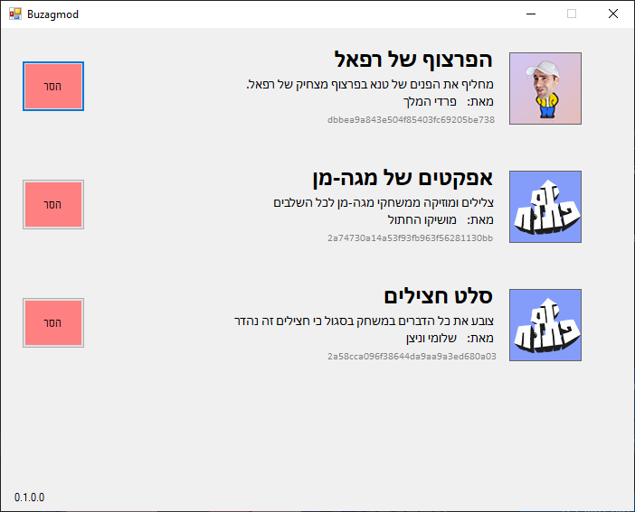
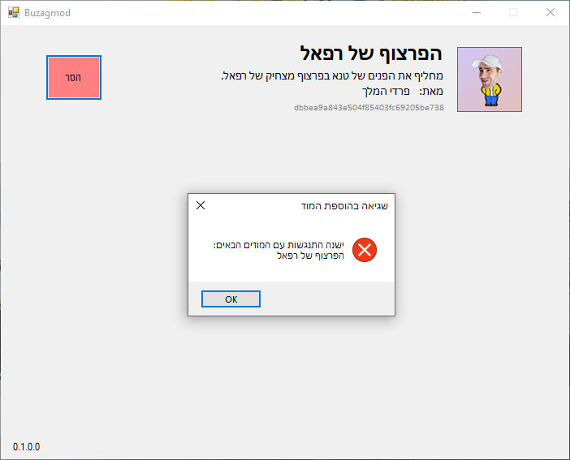

Buzagmod is a mod manager for **[Open Day](https://store.steampowered.com/app/1029650/)**. 
The binaries for the tool are distributed with the game.

Setting up your environment:
- Visual Studio (My version is 2022) with .NET 4.8
- Open the SLN file in Visual Studio.
- Install Newtonsoft.Json nuget (Project -> Manage Nugets).

---------------------------------------

The manager has a GUI. 
Mods can be added by dragging a valid mod archive to the GUI window:

Installed mods will show on the list.

The manager tracks the files in use by all installed mods. 
When attempting to install a new mod that will cause a conflict, 
the manager lets the user know which mods are already using these files.

